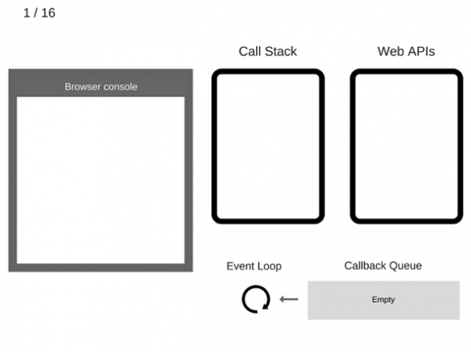
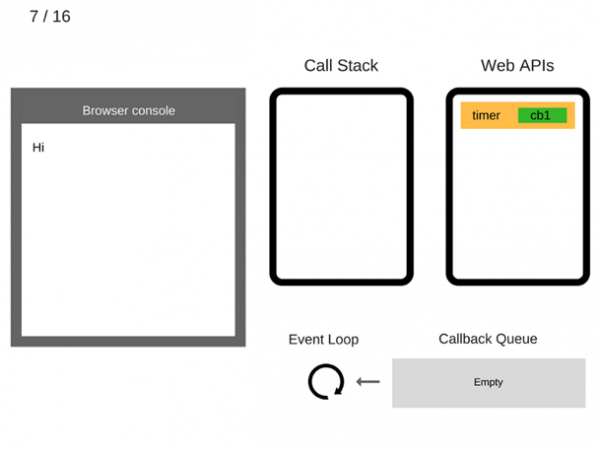
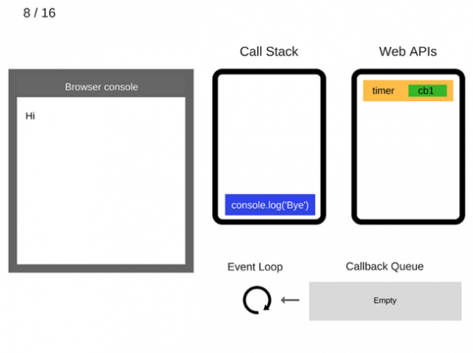
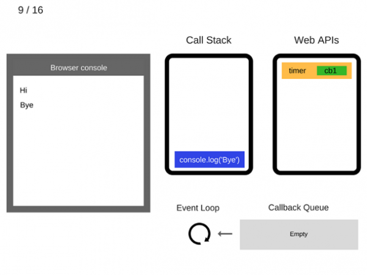
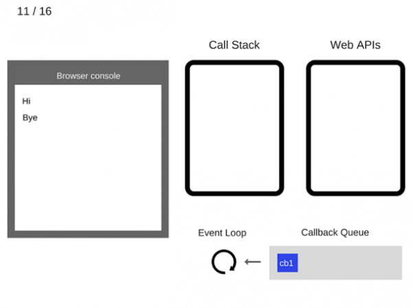
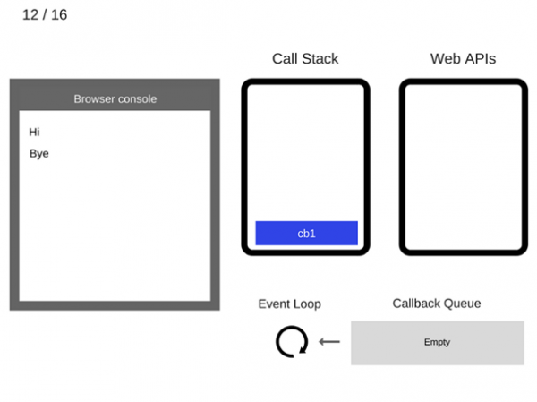
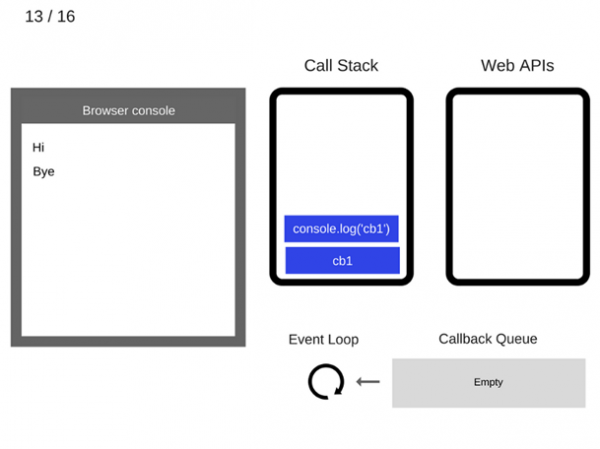
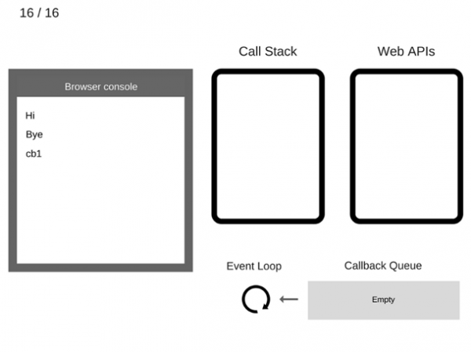

## 01. Паралельные вычисления

### 1. Область параллельных вычислений

Есть несколько понятий, связанных с областью параллельных вычислений:
- Многопоточное исполнение (multithreading)
- Параллельное исполнение (parallel execution)
- Асинхронное исполнение (asynchrony)

Пример, вам нужно выкопать во дворе бассейн:
- Вы взяли лопату и копаете - это **однопоточное исполнение**
- Вы пригласили друга Васю и копаете вместе - это **многопоточное исполнение**
- Пока вы копаете бассейн, Вася копает канаву под водопровод - это **параллельное исполнение**
- Вы пригласили бригаду землекопов, а сами пошли пить пиво. Когда бригада все сделает, к вам придут за деньгами - это **асинхронное исполнение**
Количество лопат в хозяйстве - это количество ядер в системе.

**Многопоточная работа** - работа в разных потоках.
**Параллельная работа** - разбиение одной задачи на независимые подзадачи и выполнение этих подзадач одновременно разными потоками. 
**Асинхронная работа** - когда мы ставим какую-то задачу, но не ждем ответа, а продолжаем делать свою работу. А когда будет готов ответ - нас уведомят. Асинхронность может работать и в одном, и во многих потоках.
Количество ядер процессора определяет сколько потоков могут одновременно быть в активном состоянии.

---

### 2. Контекст выполнения

`Контекст выполнения` (execution context) — окружение, в котором производится выполнение кода на JavaScript.

В JavaScript существует три типа контекстов выполнения:

- *Глобальный контекст выполнения* - если код находится за пределами функции - он принадлежит глобальному контексту.   
  Глобальный контекст характеризуется наличием глобального объекта (в браузере это объект window, в nodejs это объект global), и тем, что ключевое слово this указывает на этот глобальный объект. 

- *Контекст выполнения функции* - каждый раз, когда вызывается функция, для неё создаётся контекст.  

- *Контекст выполнения функции eval* - код, выполняемый внутри функции eval, имеет собственный контекст. 

---

### 3. Стек и Очередь

Две из наиболее часто используемых структур данных в веб-разработке - это стек и очередь.

`Стек` — это коллекция, элементы которой получают по принципу «последний вошел, первый вышел» (Last In - First Out (LIFO)). 
```js
var stack = [];
stack.push(2);       // stack is now [2]
stack.push(5);       // stack is now [2, 5]
var i = stack.pop(); // stack is now [2]
alert(i);            // displays 5
```

`Очередь` — это коллекция, элементы которой получают по принципу «первый вошел, первый вышел» (First In - First Out (FIFO)). 
```js
var queue = [];
queue.push(2);         // queue is now [2]
queue.push(5);         // queue is now [2, 5]
var i = queue.shift(); // queue is now [5]
alert(i);              // displays 2
```

---

### 4. Стек выполнения или стек вызовов 

`JavaScript — однопоточный язык программирования`. Это значит, что имеется только один поток выполнения и один стек выполнения, в который помещаются функции в очередь на выполнение. Следовательно в один момент времени JavaScript может выполнить только одну операцию, другие операции при этом будут ждать своей очереди в стеке, пока их не вызовут.

`Стек выполнения (execution stack) или стек вызовов (call stack)` - это LIFO-стек, который используется для хранения контекстов выполнения, создаваемых в ходе работы кода.

Изучим эту идею с помощью примера:
```js
let a = 'Hello World!';
function first() {
  console.log('Inside first function');
  second();
  console.log('Again inside first function');
}
function second() {
  console.log('Inside second function');
}
first();
console.log('Inside Global Execution Context');
```

Вот как будет меняться стек вызовов при выполнении этого кода:    


- Когда код загружается, JavaScript-движок создаёт глобальный контекст и помещает его в стек вызовов. 
- При вызове функции first() движок создаёт для этой функции новый контекст и помещает его в верхнюю часть стека.
- При вызове функции second() из функции first() для этой функции создаётся новый контекст выполнения и так же помещается в верхнюю часть стека. 
- После того, как функция second() завершает работу, её контекст извлекается из стека и управление передаётся контексту выполнения, находящемуся в стеке под ним, то-есть, контексту функции first().
- Когда функция first() завершает работу, её контекст извлекается из стека и управление передаётся глобальному контексту. 
- После того, как весь код оказывается выполненным, движок извлекает глобальный контекст выполнения из текущего стека.

Код описанный выше - это **синхронный код** - каждая новая строка в коде выполняется только тогда, когда выполнится предыдущая.

А теперь крайне интересный вопрос. ***Как тогда работает асинхронность в JavasScript?**

---

### 5. Асинхронность в JavasScript, Event loop

JavaScript — однопоточный язык программирования, а асинхронное поведение не является частью самого языка, оно доступно через браузерные WebAPI за счёт цикла событий **event loop, который отвечает за выполнение кода, сбор и обработку событий и выполнения задач из **очереди**.

`Помимо 'стека' в браузерах присутствует 'очередь'` для работы с WebAPI: клики, таймауты, AJAX-запросы, веб-воркеры. Функции из этой очереди выполнятся по порядку только после того, как стек будет полностью очищен. Только после этого они помещаются из очереди в стек на выполнение. Если в стеке в данный момент находится хотя бы один элемент, то они в стек попасть не могут. Как раз именно из-за этого вызов функций по таймауту часто бывает не точным по времени, так как функция не может попасть из очереди в стек, пока он заполнен.

Рассмотрим следующий пример и займёмся его пошаговым «выполнением»:
```js
console.log('Hi');
setTimeout(function cb1() {
    console.log('cb1');
}, 5000);
console.log('Bye');
```

1) Пока ничего не происходит. Консоль браузера чиста, стек вызовов пуст     


2) Потом команда console.log(‘Hi’) добавляется в стек вызовов     


3) И она выполняется    


4) Затем console.log(‘Hi’) удаляется из стека вызовов       


5) Теперь переходим к команде setTimeout(function cb1() { … }). Она добавляется в стек вызовов       


6) Команда setTimeout(function cb1() { … }) выполняется. Браузер создаёт таймер, являющийся частью Web API. Он будет выполнять обратный отсчёт времени       


7) Команда setTimeout(function cb1() { … }) завершила работу и удаляется из стека вызовов       


8) Команда console.log(‘Bye’) добавляется в стек вызовов       


9) Команда console.log(‘Bye’) выполняется       


10) Команда console.log(‘Bye’) удаляется из стека вызовов       


11) После того, как пройдут, как минимум, 5000 мс., таймер завершает работу и помещает коллбэк cb1 в очередь коллбэков       


12) Цикл событий берёт функцию cb1 из очереди коллбэков и помещает её в стек вызовов       


13) Функция cb1 выполняется и добавляет console.log(‘cb1’) в стек вызовов       


14) Команда console.log(‘cb1’) выполняется       


15) Команда console.log(‘cb1’) удаляется из стека вызовов       


16) Функция cb1 удаляется из стека вызовов       



