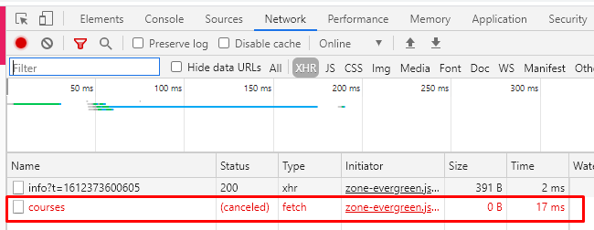

## 05. Observable для выполнения запроссов. Отмена выполнения запроссов

Создаем Observable с помощью которого будем выполнять запросы

```js
import { Observable } from 'rxjs';

// Метод для выполнения запросов к серверу -
// возвращает Observer
export function createHttpObservable(url: string) {
  // Observable.create - создает Observable.
  // Параметром принимает ф-цию, которая описывает, 
  // как Observable будет работать со своими наблюдателями-подписчиками (observer)
  return Observable.create(observer => {

    // Чтобы отменить запрос fetch существует специальный встроенный объект: AbortController, 
    // который можно использовать для отмены fetch запросов.
    // AbortController имеет:
    // - метод abort() - для отмены выполнения запроса
    // - свойство signal - при значении true этого свойства - срабатывает отмена выполнения запроса
    // (данное свойство передается в объект параметров метода fetch)
    const controller = new AbortController();
    const signal = controller.signal;

    // С помощью методов next, error, complete происходит взаимодействие с наблюдателями

    fetch(url, {signal})
      .then(response => {
        return response.json();
      })
      .then(body => {
        // next() - выдаем наблюдателям новые данные
        observer.next(body);

        // complete() - оповещаем наблюдателей, что поток завершился и новой информации не будет
        observer.complete();
      })
      .catch(err => {
        // error() - оповещаем наблюдателей об ошибке
        observer.error(err);
      })

    // Возвращаем ф-цию, которая будет выполняться внутри метода unsubscribe на данном потоке - 
    // когда подписчик отказывается от прослушки потока - и которая будет отменять запрос 
    return () => controller.abort();
    
  })
}

// Выполняем запрос
const http$ = createHttpObservable('/api/courses');
const sub = http$.subscribe(console.log);

// Через 10мс - отменяем выполнение запросса 
setTimeout(() => sub.unsubscribe(), 10);
```

В результате отмены запросса во вкладке Network имеем следуущее:    
