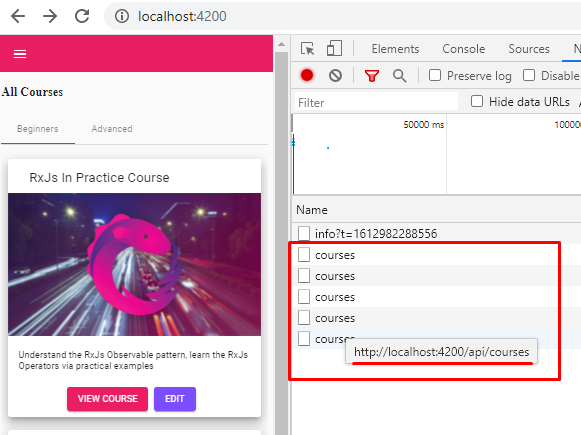

## 01. Сохранение и извлечение данных из store

На стартовом этапе мы имеем готовое работающее приложение. Опишем его работу.        
При входе на главную страницу "All Courses" http://localhost:4200/ - происходит запрос к API, в результате которого мы получаем данные, которые отображаем на странице. Если мы перейдем на другую страницу, а затем повторно вернемся на страницу "All Courses" - произойдет повторный запрос к API, и так будет происходить постоянно:

**Наша задача** - после первого запроса к API - сохранить данные на стороне клиента в кастомном store, и в дальнейшем, при возвращении на страницу "All Courses" - получать данные не от API, а из кастомного store.

**Логика работы с кастомным store:**
- Создадим файл *src\app\common\store.service.ts* в котором реализуем логику store с помощью сабжекта
- при запуске приложения, внутри app.component, происходит обращение к методу хранилища - store.init(), который получает от сервера данные и пушит их в сабжект
- далее загружается страница "All Courses" http://localhost:4200/ - а именно home.component, внутри которого мы обращаемся к методам store для извлечения данных из него
