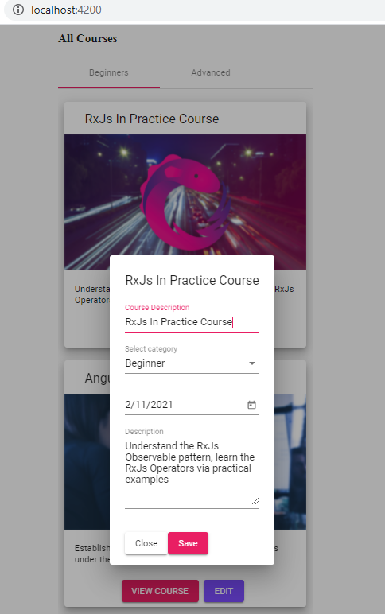

## 02. Изменение данных в store

Находясь на странице "All Courses" http://localhost:4200/ и кликнув на EDIT - открывается окно модификации данных:

**Наша задача** - сохранить измененные данные в store.