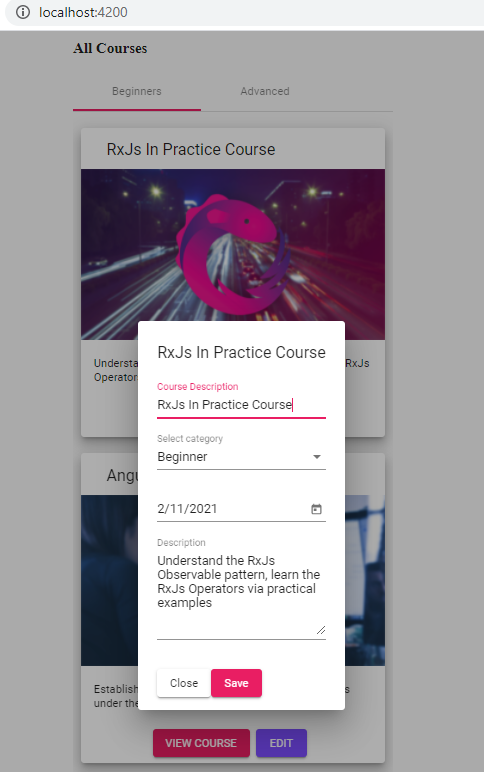

## 02. Изменение данных в store

Находясь на странице "All Courses" http://localhost:4200/ и кликнув на EDIT - открывается окно модификации данных:

**Наша задача** - сохранить измененные данные в store.

**Логика сохранения данных в store:**
- чтобы сохранить данные после внесения изменений - кликаем 'Save' - внутри course-dialog.component срабатывает метод save(), который вызывает метод store.saveStore(), передавая ему id курса, который мы изменили + изменения
- метод store.saveStore реализует логику сохранения данных в store, а также отправляет запрос на сервер с целью сохранения данных
