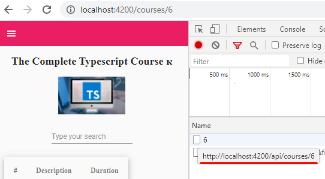

## 03. Извлечение выбранного курса из store

Нажав VIEW COURSE на странице "All Courses" http://localhost:4200/ для просмотра информации курса - происходит запрос к API, в результате которого мы получаем данные, которые отображаем на странице (напр. http://localhost:4200/courses/6):

**Наша задача** - получать данные не от API, а из store.

**Реализация данной задачи**:
- после нажатия VIEW COURSE внутри courses-card-list.component - происходит перенаправление к course.component, где мы обращаемся к методу store.selectCourseById()
- store.selectCourseById() извлекает из store выбранный курс и возвращает поток данных обратно в course.component