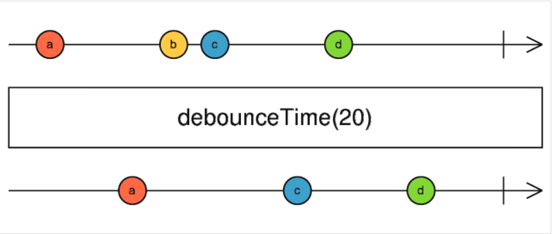

## debounceTime



**debounceTime** - эмитит последнее значение потока, если в указанный промежуток времени не поступило нового значения. Интервал задается в миллисекундах.

ПРИМЕР:

```html
<input type="text" id="search">
```
```js
import { fromEvent } from 'rxjs';
import { debounceTime, map } from 'rxjs/operators';

const searchBox = document.getElementById('search');
const keyup$ = fromEvent(searchBox, 'keyup');

keyup$
  .pipe(
    map((data: any) => data.currentTarget.value),
    debounceTime(2000)
  )
  .subscribe(console.log);
```

В примере выше - в поле input вводим значения, останавливаемся и только через 2с в консоли увидим результат.    
Если в поле input будем вводить значения безостановочно в течении 10с - в консоли ничего не увидим. И только когда остановимся и выдержим паузу в 2с - в консоли увидим результат.  
