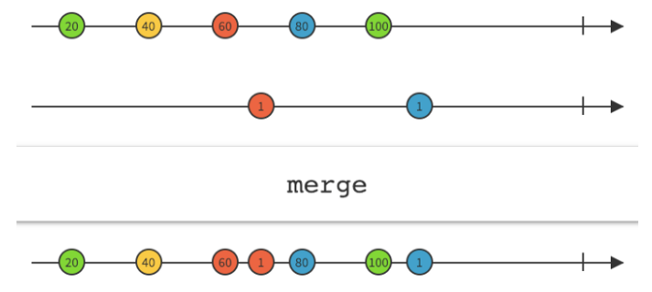

## merge



```js
// of() - создает из аргументов Observable
const sourse1$ = of(10, 20).pipe(
  delay(1500)
);
const sourse2$ = of(30, 40).pipe(
  delay(3000)
);
const sourse3$ = of(50, 60).pipe(
  delay(100)
);

// merge() - объединяет полученные Observable в один.
// В отличии от concat() - все переданные объекты выполняются независимо и не дожидаясь завершения друг от друг
const result$ = merge(sourse1$, sourse2$, sourse3$);

result$.subscribe(console.log);

// РЕЗУЛЬТАТ:
// 50
// 60
// 10
// 20
// 30
// 40
```