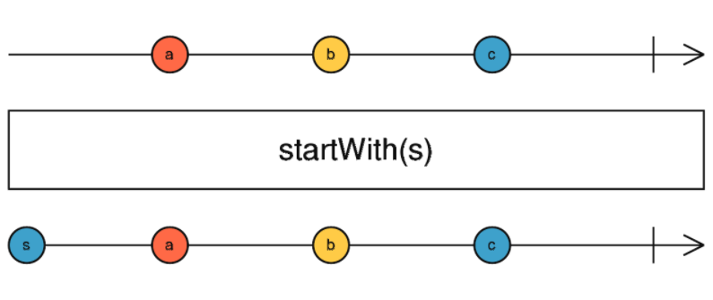

## startWith



**startWith** - начинает поток со значений, которые переданные оператору в качестве аргументов.

```js
of("from source")
  .pipe(startWith("first", "second"))
  .subscribe(console.log);

// "first"
// "second"
// "from source"
```